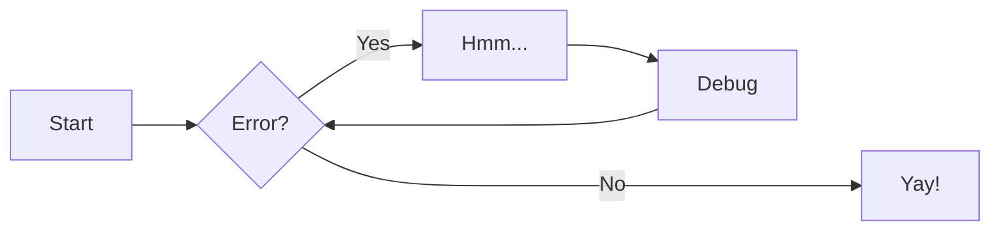

---
hide:
  - navigation
  - toc
---

# The RISC-V Instruction Set Manual
## Volume II: Privileged Architecture
### Document Version 20211203

# Preface
Bu dökümanda RISC-V Privelege mimarisi açıklanmıştır.
Versiyon : 20211203
Aşağıdaki RISC-V ISA modüllerini içerir


### Değişiklikler kısmı çevrilmedi
Added optional big-endian and bi-endian support.
Made priority of load/store/AMO address-misaligned exceptions implementation-defined relative to load/store/AMO page-fault and access-fault exceptions.
PMP reset values are now platform-defined.
 An additional 48 optional PMP registers have been defined.
 Slightly relaxed the atomicity requirement for A and D bit updates performed by the implementation.
 Clarify the architectural behavior of address-translation caches.
 Added Sv57 and Sv57x4 address translation modes.
 Clarified that bare S-mode need not support the SFENCE.VMA instruction.
Specified relaxed constraints for implicit reads of non-idempotent regions.
Added the Svnapot Standard Extension, along with the N bit in Sv39, Sv48, and Sv57 PTEs
Added the Svpbmt Standard Extension, along with the PBMT bits in Sv39, Sv48, and Sv57 PTEs.
Added the Svinval Standard Extension and associated instructions.
Finally, the hypervisor architecture proposal has been extensively revised.
----------------------------------------------

# Preface to Version 1.11
This is version 1.11 of the RISC-V privileged architecture. The document contains the following
versions of the RISC-V ISA modules:

versityon 1.10 üzerinde yapılan değişikler
- The virtual-memory system no longer permits supervisor mode to execute instructions from user pages, regardless of the SUM setting.
- Clarified that ASIDs are private to a hart, and added commentary about the possibility of a future global-ASID extension.
- SFENCE.VMA semantics have been clarified.
- Required all harts in a system to employ the same PTE-update scheme as each other
- Described scheme for emulating misaligned AMOs.
- Specified the behavior of the misa and xepc registers in systems with variable IALIGN.
-  Specified semantics for PMP regions coarser than four bytes.


# Chapter 1
## Introduction
Bu döküman RISC-V privelege mimarisini açıklar. Unprivlege modun yanı sıra operating system çalıştırmak ve harici cihazlarla bağlantı sağlamak için ekstra fonsiyonelliklerin eklenmesi gerekmektedir.

# 1.1 RISC-V Privileged Software Stack Terminology


!!! note

    Lorem ipsum dolor sit amet, consectetur adipiscing elit. Nulla et euismod
    nulla. Curabitur feugiat, tortor non consequat finibus, justo purus auctor
    massa, nec semper lorem quam in massa.

!!! pied-piper "Pied Piper"

    Lorem ipsum dolor sit amet, consectetur adipiscing elit. Nulla et
    euismod nulla. Curabitur feugiat, tortor non consequat finibus, justo
    purus auctor massa, nec semper lorem quam in massa.

[Subscribe to our newsletter](#){ .md-button }


``` systemverilog
`timescale 1ns/ 100 ps

module FIFO_v #(parameter ADDR_W = 4, DATA_W = 24, BUFF_L = 16, ALMST_F = 3, ALMST_E = 3) 	// buffer length must be less than or equal to address space as in  BUFF_L <or= 2^(ADDR_W)-1
			(
			output reg 		[DATA_W- 1	:	0]				data_out,
			output reg 		[ADDR_W		:	0]				data_count,
			output	reg															empty,
			output	reg															full,
			output	reg															almst_empty,
			output	reg															almst_full,
			output	reg															err,
			input		wire	[DATA_W -1	:	0]				data_in,
			input		wire														wr_en,
			input		wire														rd_en,
			input		wire 														n_reset,
			input		wire														clk
			);
			
			
////--------------- internal variables ---------------------------------------------------------			
			
			reg 				[DATA_W-1 : 0] 	mem_array [0 : (2**ADDR_W)-1];
			reg					[ADDR_W-1 : 0]	rd_ptr, wr_ptr;
			reg					[ADDR_W-1 : 0]	rd_ptr_nxt, wr_ptr_nxt;
			reg														full_ff, empty_ff;
			reg														full_ff_nxt, empty_ff_nxt;
			reg														almst_f_ff, almst_e_ff;
			reg														almst_f_ff_nxt, almst_e_ff_nxt;
			reg					[ADDR_W : 0]		q_reg, q_nxt;
			reg														q_add, q_sub;
//// ------------------------------------------------------------------------------------------------


//// Always block to update the states
//// ------------------------------------------------------------------------------------------------
	always @ (posedge clk)
		begin	:	reg_update
			if(n_reset == 1'b 0)
				begin
					rd_ptr <= {(ADDR_W-1){1'b 0}};
					wr_ptr <= {(ADDR_W-1){1'b 0}};
					full_ff <= 1'b 0;
					empty_ff <= 1'b 1;
					almst_f_ff <= 1'b 0;
					almst_e_ff <= 1'b 1;
					q_reg <= {(ADDR_W){1'b 0}};
				end
			else
				begin
					rd_ptr <= rd_ptr_nxt;
					wr_ptr <= wr_ptr_nxt;
					full_ff <= full_ff_nxt;
					empty_ff <= empty_ff_nxt;
					almst_f_ff <= almst_f_ff_nxt;
					almst_e_ff <= almst_e_ff_nxt;
					q_reg <= q_nxt;
				 end
		end	// end of always

//// Control for almost full and almost emptly flags
//// ------------------------------------------------------------------------------------------------
	always @ ( almst_e_ff, almst_f_ff, q_reg)
		begin	:	Wtr_Mrk_Cont
			almst_e_ff_nxt = almst_e_ff;
			almst_f_ff_nxt = almst_f_ff;				
		   //// check to see if wr_ptr is ALMST_E away from rd_ptr (aka almost empty)			
			if(q_reg < ALMST_E)
				almst_e_ff_nxt = 1'b 1;
			else
				almst_e_ff_nxt = 1'b 0;

			if(q_reg > BUFF_L-ALMST_F)
				almst_f_ff_nxt = 1'b 1;
			else
				almst_f_ff_nxt = 1'b 0;
				
		end	// end of always
			
//// Control for read and write pointers and empty/full flip flops			
	always @ (wr_en, rd_en, wr_ptr, rd_ptr, empty_ff, full_ff, q_reg)
		begin
			
			wr_ptr_nxt = wr_ptr ;											//// no change to pointers
			rd_ptr_nxt = rd_ptr;
			full_ff_nxt = full_ff;
			empty_ff_nxt = empty_ff;
			q_add = 1'b 0;
			q_sub = 1'b 0;
		////---------- check if fifo is full during a write attempt, after a write increment counter
		////----------------------------------------------------			
			if(wr_en == 1'b 1 & rd_en == 1'b 0)
				begin
					if(full_ff == 1'b 0)
						begin
							if(wr_ptr < BUFF_L-1)									
								begin
									q_add = 1'b 1;
									wr_ptr_nxt = wr_ptr + 1;
									empty_ff_nxt = 1'b 0;
								end
							else
								begin
									wr_ptr_nxt = {(ADDR_W-1){1'b 0}};
									empty_ff_nxt = 1'b 0;
								end
							//// check if fifo is full
							if( (wr_ptr+1 == rd_ptr) || ((wr_ptr == BUFF_L-1) && (rd_ptr == 1'b 0)))   
								full_ff_nxt = 1'b 1;
						end
				end
					
		////---------- check to see if fifo is empty during a read attempt, after a read decrement counter
		////---------------------------------------------------------------
			if( (wr_en == 1'b 0) && (rd_en == 1'b 1))
				begin					
					if(empty_ff == 1'b 0) 
						begin
							if(rd_ptr < BUFF_L-1 )													
								begin
									if(q_reg > 0)
										q_sub = 1'b 1;
									else
										q_sub = 1'b 0;
									rd_ptr_nxt = rd_ptr + 1;
									full_ff_nxt = 1'b 0;
								end
							else	
								begin
									rd_ptr_nxt = {(ADDR_W-1){1'b 0}}; 
									full_ff_nxt = 1'b 0;		
								end
			
							//// check if fifo is empty
							if( (rd_ptr  + 1 == wr_ptr) || ((rd_ptr == BUFF_L -1) && (wr_ptr == 1'b 0 )))  
								empty_ff_nxt = 1'b 1;
						end
				end
			
		//// -----------------------------------------------------------------
			if( (wr_en == 1'b 1) && (rd_en == 1'b 1)) 
				begin
					if(wr_ptr < BUFF_L -1) 
						wr_ptr_nxt = wr_ptr  + 1;	
					else											
						wr_ptr_nxt =  {(ADDR_W-1){1'b 0}}; 
					
					if(rd_ptr < BUFF_L -1) 
						rd_ptr_nxt = rd_ptr + 1;		
					else
						rd_ptr_nxt = {(ADDR_W-1){1'b 0}}; 
				end
			
		end  // end of always


//// Control for memory array writing and reading
//// ----------------------------------------------------------------------
	always @ (posedge clk)
		begin		:		mem_cont
			if( n_reset == 1'b 0)
				begin
					mem_array[rd_ptr] <=  {(DATA_W-1){1'b 0}}; 
					data_out <= {(DATA_W-1){1'b 0}}; 
					err <= 1'b 0;
				end
			else
				begin
					////  if write enable and not full then latch in data and increment wright pointer	
					if( (wr_en == 1'b 1) && (full_ff == 1'b 0) )
						begin
							mem_array[wr_ptr] <=  data_in;
							err <= 1'b 0;						
						end
					else if( (wr_en == 1'b 1) && (full_ff == 1'b 1))      ////  check if full and trying to write
						err <= 1'b 1;
						
					//// if read enable and fifo not empty then latch data out and increment read pointer
					if( (rd_en == 1'b 1) && (empty_ff == 1'b 0))
						begin
							data_out <= mem_array[rd_ptr];
							err <= 1'b 0;
						end
					else if( (rd_en == 1'b 1) && (empty_ff == 1'b 1))
						err <= 1'b 1;
						
				end	// end else
		end	// end always
						
			
//// Combo Counter with Control Flags
//// ------------------------------------------------------------------------------------------------
	always @ ( q_sub, q_add, q_reg)
		begin	:	Counter
			case( {q_sub , q_add} )
				2'b 01 :
						q_nxt = q_reg + 1;
				2'b 10 :
						q_nxt = q_reg - 1;
				default :
						q_nxt = q_reg;
			endcase 	
		end	// end of always		
			
//// Connect internal regs to ouput ports
//// ------------------------------------------------------------------------------------------------
	always @ (full_ff, empty_ff, almst_e_ff, almst_f_ff, q_reg)
		begin
			full = full_ff;
			empty = empty_ff;
			almst_empty = almst_e_ff; 
			almst_full = almst_f_ff;
			data_count = q_reg;
		end
			
endmodule


```

1.  :man_raising_hand: I'm a code annotation! I can contain `code`, __formatted
    text__, images, ... basically anything that can be written in Markdown.





Text can be {--deleted--} and replacement text {++added++}. This can also be
combined into {~~one~>a single~~} operation. {==Highlighting==} is also
possible {>>and comments can be added inline<<}.

{==

Formatting can also be applied to blocks by putting the opening and closing
tags on separate lines and adding new lines between the tags and the content.

==}

<div class="grid cards" markdown>

-   :material-clock-fast:{ .lg .middle } __Set up in 5 minutes__

    ---

    Install [`mkdocs-material`](#) with [`pip`](#) and get up
    and running in minutes

    [:octicons-arrow-right-24: Getting started](#)

-   :fontawesome-brands-markdown:{ .lg .middle } __It's just Markdown__

    ---

    Focus on your content and generate a responsive and searchable static site

    [:octicons-arrow-right-24: Reference](#)

-   :material-format-font:{ .lg .middle } __Made to measure__

    ---

    Change the colors, fonts, language, icons, logo and more with a few lines

    [:octicons-arrow-right-24: Customization](#)

-   :material-scale-balance:{ .lg .middle } __Open Source, MIT__

    ---

    Material for MkDocs is licensed under MIT and available on [GitHub]

    [:octicons-arrow-right-24: License](#)

</div>


:smile:


$$
\operatorname{ker} f=\{g\in G:f(g)=e_{H}\}{\mbox{.}}
$$
